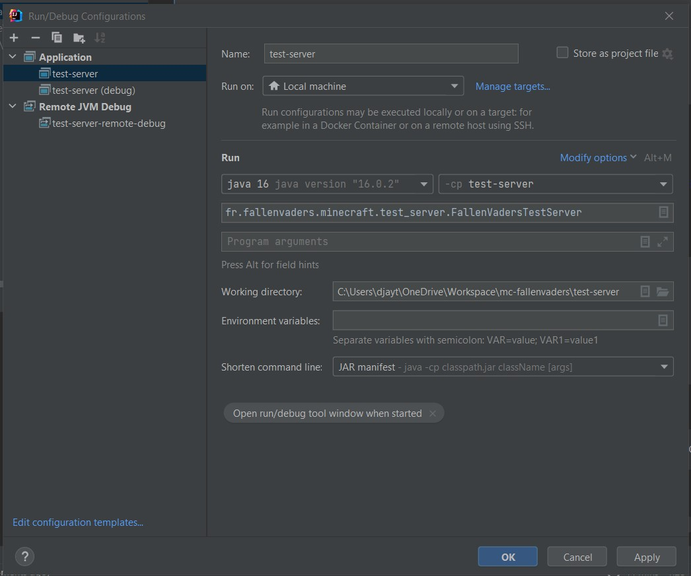
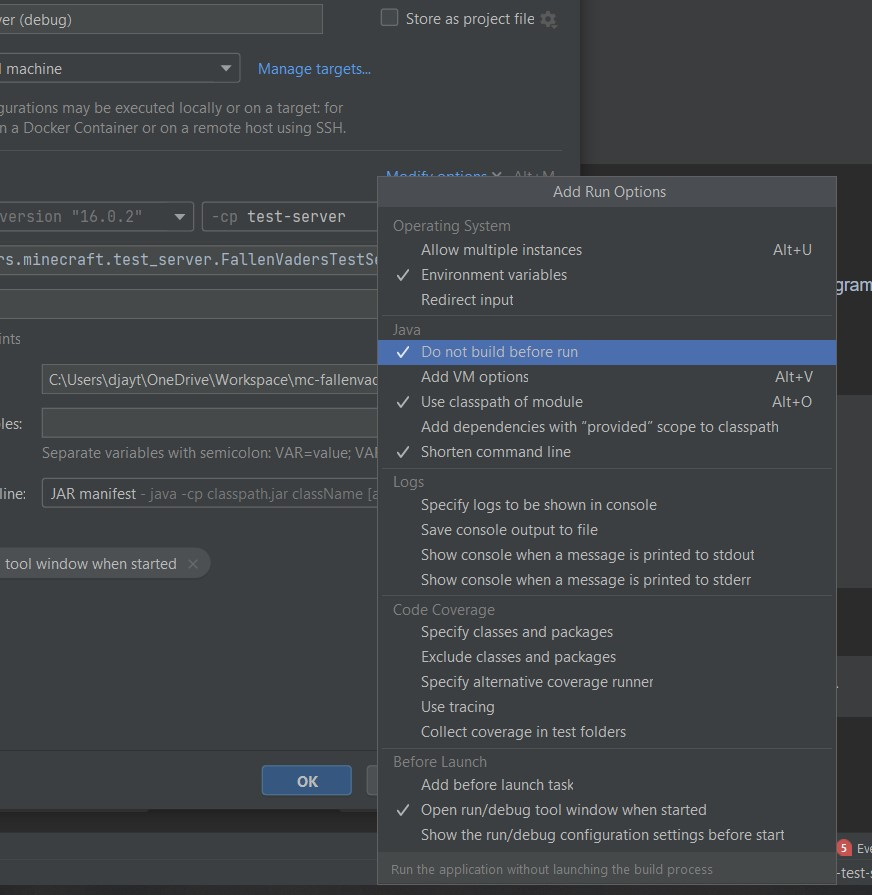
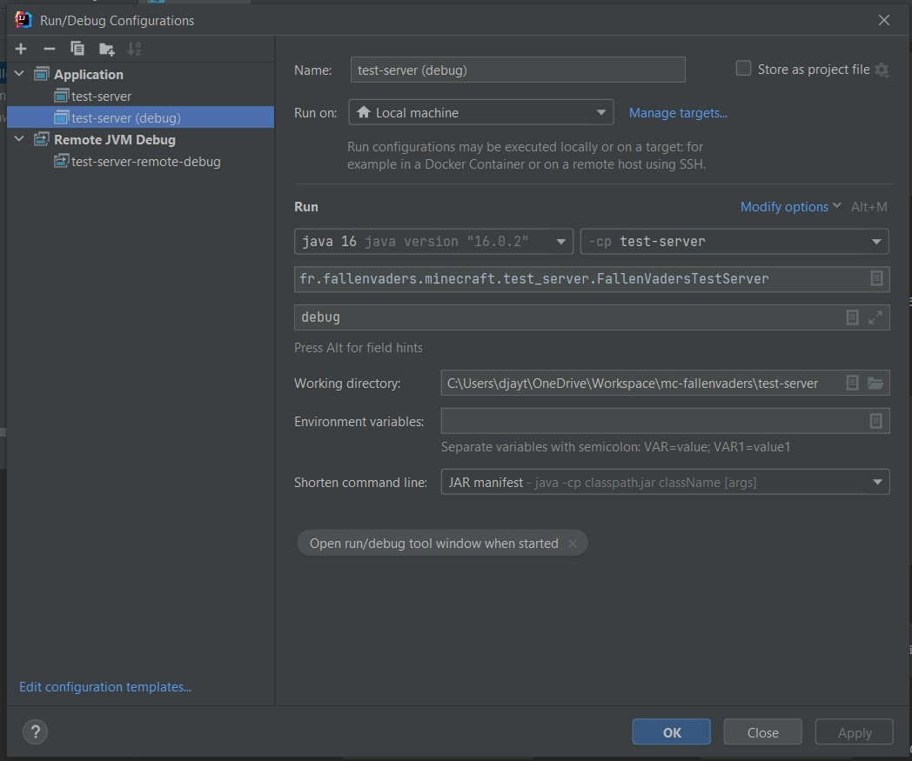
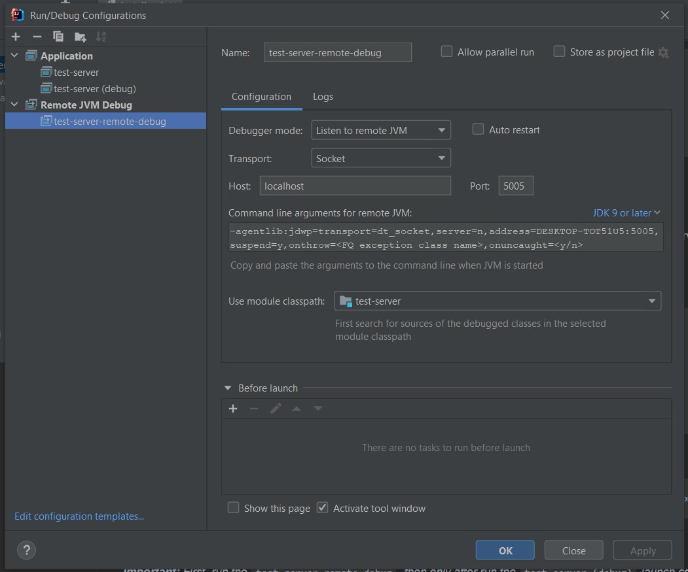

# Installation

## Prerequisites

To process installation, you must have installed in your environment these
following programs:
* [Java 16](https://www.oracle.com/java/technologies/javase-jdk16-downloads.html) or above
* [Maven 3](https://maven.apache.org/download.cgi#)
* An IDE *([IntelliJ IDEA](https://www.jetbrains.com/fr-fr/idea/) recommended)*

## Initialization

After cloning sources, run this command at the root folder of the project:
```shell
$ mvn initialize
```
Then run the compilation command presented below.

## Compile project

After each code update or for project initialization, run this command:
```shell
$ mvn clean install
```

## Launch server

To launch the test server, you have two options:
* Running from the corresponding script (`start.bat` on Windows, `start.sh` on Linux)
* Launch a configuration from your IDE (recommended)

### Launch server from IDE configuration

***Warning:** the following information match correctly with Intellij IDEA that
we recommend to use for this project. If this is not your case, you should find
by yourself the specific steps to follow for your IDE without promise to success
for debug setup section.*

> Configuration name: *test-server*  
> Classpath (or -cp): *test-server*  
> Main class: *fr.fallenvaders.minecraft.test_server.FallenVadersTestServer*  
> Working directory: *path\to\mc-fallenvaders\test-server*  
> Shorten command line: *JAR manifest*

You may obtain something like this:  


***Important:** It's recommended to deactivate the auto-build of the IDE. Because we
use Maven as compiler, the default build is useless, may fail and take time before
the launch.*

For achieve this, click on "Modify options" and then mark the option "Do not build before run".
You can see the screen below:  


***Note:** If you want to conserve the behavior of build before run, just add a Maven
before task.*

***Note 2:** For stopping the server, enter `stop` in the server console. If you try to
stop it through the IDE's stop button it will not work.*

## Debug mode

Debug mode allow you to place breakpoint and browse your code step by step, see variables values in live, etc.

For activate it, first it's recommended to clone the previously created launch configuration
and rename it "test-server (debug)".
Then, add to "Program arguments" this one: `debug`. It tells the test-server
to run in debug mode.
You should obtain something like this:  


Then, create a "Remote JVM Debug" launch config with these params:

> Configuration name: *test-server-remote-debug*  
> Debugger mode: *Listen to remote JVM*  
> Transport: *Socket*  
> Host: *localhost*  
> Port: *5005* (or what you want that isn't the server port or other
    one already in use)  
> Classpath: *test-server*

You may obtain a generated "Command line arguments for JVM" like this one:
```
-agentlib:jdwp=transport=dt_socket,server=n,address=DESKTOP-TOT51U5:5005,suspend=y,onthrow=<FQ exception class name>,onuncaught=<y/n>
```

The result must be similar as this one:  


Now, you can run by pressing on the hammer button.

***Important:** First, run the `test-server-remote-debug`, then only after run
the `test-server (debug)` launch config.*

If you success, you may obtain this message in `test-server-remote-debug`'s output console:
```
Connected to the target VM, address: 'localhost:5005', transport: 'socket'
```

If you launch server in wrong order, you may obtain this error message:
```
ERROR: transport error 202: connect failed: Connection refused
ERROR: JDWP Transport dt_socket failed to initialize, TRANSPORT_INIT(510)
JDWP exit error AGENT_ERROR_TRANSPORT_INIT(197): No transports initialized [t:\workspace\open\src\jdk.jdwp.agent\share\native\libjdwp\debugInit.c:734]
```

***Note:** If you want to start the server without the remote debug, you
must run `test-server` instead of `test-server (debug)`.*
